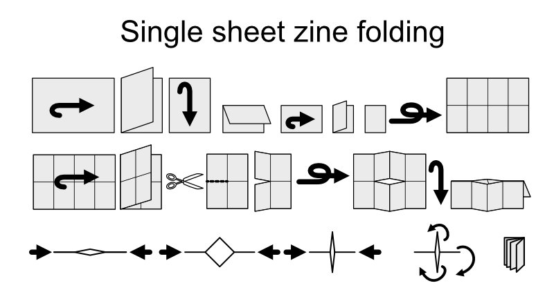

# gimpPlugins

My own Gimp plugins.

Currently any plugins here are only created for Gimp v2.10. They will probably
need modification when Gimp v3 is fully released.

# make_zine.py

This is a simple plugin to create an 8 page zine using a single sheet of page.

If you're not sure how an eight page zine is created from a single sheet, check
the folding and cutting diagram below.

To use the plugin, install it in your folder where your Gimp plugins are located.

Once installed, using the plugin is straightforward.

- Load your cover image. The file name should be of the form **NAME0.ext**, where **NAME**
  is any alphanumeric name, and **ext** is any file type supported by Gimp. For example,
  **MyZine0.png**. Note, the name must end with the digit **0**.
- From the **Image** menu select **Make zine...**.
- Complete the **python_fu_makezine** settings.
- The plugin will look for eight panel images in the same folder as the working
  image. These images should have the same extension as the working image but with
  a numeric suffix of 0 to 7. In our example, **MyZine0.png** would be the front cover and
  **MyZine7.png** would be the last page or rear cover. All pages will be resized to
  fit the eight panels.
